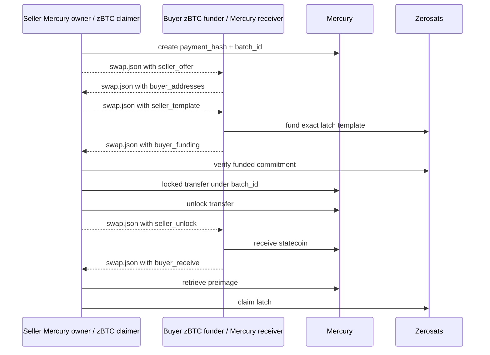

# Mercury/Zerosats Latch Swap POC

This POC swaps a Mercury statecoin for a Zerosats zBTC latch between two
operators.

- `seller`: owns the Mercury statecoin and claims the Zerosats latch.
- `buyer`: funds the Zerosats latch and receives the Mercury statecoin.

Each operator keeps a private local state file. The public protocol state is a
single `swap.json` transcript that is passed between the operators and updated
at each phase. Use fresh `--state` paths and a fresh `--swap` path for each
swap.



## Source Of Truth

`demo-tmux.sh` is the executable demo flow. It runs both roles on one machine,
but it still uses separate private local states and one public transcript:

```text
$SELLER_STATE
$BUYER_STATE
$SWAP_JSON
```

Run it from the Ciphera repo root:

```bash
pkg/mercury-latch-swap/demo-tmux.sh
```

To prepare the same runner without tmux:

```bash
export DEMO_DIR="${DEMO_DIR:-$PWD/../ciphera-demo-data/runs/manual-$(date +%s)}"
RUNNER_ONLY=1 pkg/mercury-latch-swap/demo-tmux.sh
source "$DEMO_DIR/env.sh"
"$RUNNER"
```

`demo.log` shows readable setup sections and numbered swap steps.

## Build

From the Ciphera repo root:

```bash
export CIPHERA_DIR="$PWD"
export SWAP_DIR="$CIPHERA_DIR/pkg/mercury-latch-swap"
export SWAP_MANIFEST="$SWAP_DIR/Cargo.toml"

export MERCURY_LAB_DIR="${MERCURY_LAB_DIR:-$(cd "$CIPHERA_DIR/.." && pwd)/mercury-lab}"
export MERCURY_PATCH_CONFIG="patch.\"https://github.com/zerosats/mercury-lab.git\".mercuryrustlib.path=\"$MERCURY_LAB_DIR/clients/libs/rust\""

cargo build --manifest-path "$SWAP_MANIFEST" --config "$MERCURY_PATCH_CONFIG"

export SWAP="$SWAP_DIR/target/debug/mercury-latch-swap"
"$SWAP" --help
```

## Demo Inputs

Before the swap:

- Seller's Mercury wallet must contain a confirmed Mercury statecoin.
- Buyer must have a Mercury wallet that can receive the statecoin.
- Buyer must have at least `AMOUNT_SAT` spendable WCBTC in Zerosats.
- Seller must have a Zerosats wallet for the latch claim address.
- Both sides must use Mercury settings for the same Mercury server.
- Both sides must agree on amount, ticker, Citrea chain, Bitcoin explorer, and
  refund timeout.

Wallet JSON files, Mercury wallet databases, local state files, refund notes,
and the seller state after `seller claim` retrieves the preimage contain private
material. Do not commit or publish them.

Command stdout redacts local wallet/settings paths, local template/refund-note
paths, and the preimage value. The complete values are saved only in each
operator's private state file. Buyer refund notes are written as local private
files and are not included in `swap.json`.

## Operator Phase Commands

At any point after local state exists, either side can inspect safe progress
without printing local wallet paths or secrets:

```bash
"$SWAP" status --state "$SELLER_STATE"
"$SWAP" status --state "$BUYER_STATE"
"$SWAP" inspect-swap --swap "$SWAP_JSON"
```

The phase commands all use the same public transcript path:

```bash
export SWAP_JSON=./swap.json
```

Seller initializes private local state and creates the first public transcript
section:

```bash
"$SWAP" seller init \
  --state "$SELLER_STATE" \
  --mercury-settings-file "$SELLER_MERCURY_SETTINGS" \
  --mercury-wallet "$SELLER_MERCURY_WALLET" \
  --zerosats-wallet "$SELLER_ZEROSATS_WALLET" \
  --zerosats-wallet-dir "$ZEROSATS_WALLET_DIR" \
  --output-prefix "$SELLER_OUT" \
  --statechain-id "$STATECHAIN_ID" \
  --amount-sat "$AMOUNT_SAT" \
  --mercury-amount-sat "$MERCURY_AMOUNT_SAT"

"$SWAP" seller offer --state "$SELLER_STATE" --swap "$SWAP_JSON"
```

Buyer imports the offer from `swap.json`, creates addresses, and updates the
same transcript:

```bash
"$SWAP" buyer accept \
  --state "$BUYER_STATE" \
  --swap "$SWAP_JSON" \
  --mercury-settings-file "$BUYER_MERCURY_SETTINGS" \
  --mercury-wallet "$BUYER_MERCURY_WALLET" \
  --zerosats-wallet "$BUYER_ZEROSATS_WALLET" \
  --zerosats-wallet-dir "$ZEROSATS_WALLET_DIR" \
  --output-prefix "$BUYER_OUT"
```

Seller imports buyer addresses, creates the latch template, and updates
`swap.json`:

```bash
"$SWAP" seller template --state "$SELLER_STATE" --swap "$SWAP_JSON"
```

Buyer imports the template, funds it, keeps the refund note locally, and writes
only public funding details into `swap.json`:

```bash
"$SWAP" buyer fund --state "$BUYER_STATE" --swap "$SWAP_JSON"
```

Seller verifies the funded latch, starts the Mercury transfer, unlocks it, and
updates `swap.json`. This is the value-release phase, so it requires an explicit
`--release-mercury` acknowledgment:

```bash
"$SWAP" seller release \
  --state "$SELLER_STATE" \
  --swap "$SWAP_JSON" \
  --release-mercury
```

Buyer receives the Mercury statecoin and updates `swap.json` with receive
confirmation:

```bash
"$SWAP" buyer receive --state "$BUYER_STATE" --swap "$SWAP_JSON"
```

Seller imports the receive confirmation, retrieves the preimage, and claims the
Zerosats latch:

```bash
"$SWAP" seller claim --state "$SELLER_STATE" --swap "$SWAP_JSON"
```

## Transcript Rules

- `seller_offer` carries terms, `payment_hash`, and `batch_id`.
- `buyer_addresses` carries the Mercury receive address and Zerosats refund
  address.
- `seller_template` embeds the latch template JSON so buyer import writes a
  local template file instead of using seller paths.
- `buyer_funding` excludes the buyer refund note and remaining buyer balance.
- `seller_unlock` tells the buyer the Mercury transfer is unlocked.
- `buyer_receive` lets seller attempt preimage retrieval; Mercury is still the
  final gate for releasing the preimage.
- The Mercury preimage secret is not exported in `swap.json`.
- `seller_offer` is the single source of truth for terms, payment hash, and
  batch id; later sections only add their new public data and validate against
  the offer plus the receiving local state.
- Transcript JSON is strict: unknown fields are rejected instead of ignored, so
  accidental local-only data does not silently become part of the protocol.
- Existing transcript sections cannot be silently overwritten with different
  contents.

## Abort Cases

- If buyer does not fund the Zerosats latch, seller should not run
  `seller release`.
- If seller does not unlock Mercury, buyer keeps the local refund note and waits
  for the refund path.
- If buyer cannot receive the expected statechain and Mercury amount, seller
  should not run `seller claim`.
- If seller cannot retrieve the preimage, seller cannot claim the Zerosats
  latch.

## Tests

```bash
cargo test --manifest-path "$SWAP_MANIFEST"
```
