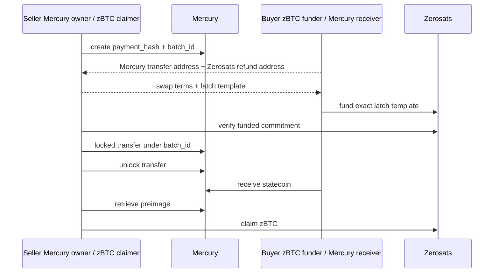

# Mercury/Ciphera Latch Swap POC

This POC swaps a Mercury statecoin for a Zerosats zBTC latch between two wallet
labels you control.

- `seller`: owns the Mercury statecoin and claims zBTC.
- `buyer`: funds the Zerosats latch and receives the Mercury statecoin.

For local demos one operator can control both labels. For hand-off demos, the
same CLI subcommands are the protocol checkpoints between the two operators.



## Source Of Truth

`demo-tmux.sh` is the detailed executable demo flow. Keep command order,
environment defaults, and operational setup there so the runbook does not drift
from the script.

```bash
cd "$CIPHERA_DIR"
pkg/mercury-latch-swap/demo-tmux.sh
```

To prepare the same run directory without tmux:

```bash
export DEMO_DIR="${DEMO_DIR:-$CIPHERA_DIR/../ciphera-demo-data/runs/manual-$(date +%s)}"
RUNNER_ONLY=1 pkg/mercury-latch-swap/demo-tmux.sh
source "$DEMO_DIR/env.sh"
"$RUNNER"
```

During a run, `demo.log` shows readable setup sections and numbered swap steps.
The swap itself is tracked in `$SWAP_STATE`.

The script prompts for the Citrea private key only when the buyer Zerosats
wallet needs minting and `CITREA_PRIVATE_KEY` is not already set. When minting
is needed, `ciphera-cli mint` approves the rollup to spend WCBTC if allowance is
not already set.

## Build

From the Ciphera repo root:

```bash
export CIPHERA_DIR="$PWD"
export SWAP_DIR="$CIPHERA_DIR/pkg/mercury-latch-swap"
export SWAP_MANIFEST="$SWAP_DIR/Cargo.toml"

export MERCURY_LAB_DIR="${MERCURY_LAB_DIR:-$(cd "$CIPHERA_DIR/.." && pwd)/mercury-lab}"
export MERCURY_PATCH_CONFIG="patch.\"https://github.com/zerosats/mercury-lab.git\".mercuryrustlib.path=\"$MERCURY_LAB_DIR/clients/libs/rust\""

cargo build --manifest-path "$SWAP_MANIFEST" --config "$MERCURY_PATCH_CONFIG"

export SWAP="$SWAP_DIR/target/debug/mercury-latch-swap"
"$SWAP" --help
```

## Demo Inputs

The swap binary does not create or fund either side. Before the swap:

- The seller's Mercury wallet must contain a confirmed Mercury statecoin.
- The buyer's Mercury wallet must exist so it can receive the statecoin.
- The buyer's Zerosats wallet must have at least `AMOUNT_SAT` spendable WCBTC.
  If the demo mints this balance, the Citrea key must hold WCBTC and cBTC for
  gas.
- The seller's Zerosats wallet must exist so it can create and claim the latch.
- The Mercury `Settings.toml` must point at the same Mercury server and
  `wallet.db` used by the Mercury client.

Wallet JSON files and Mercury wallet databases contain private material. Keep
demo data local and do not commit it.

## Step Commands

The CLI intentionally exposes the swap as explicit hand-off steps backed by one
local JSON state file:

```text
init-state
mercury-create-hash
mercury-address
zerosats-address
zerosats-template
zerosats-fund
zerosats-verify
mercury-transfer
mercury-unlock
mercury-receive
mercury-preimage
zerosats-claim
```

The tmux runner executes these subcommands in order. `init-state` creates
`$SWAP_STATE`; every later command loads it, validates the previous step data it
needs, performs its side effect, and atomically writes the updated state.

Most repeated flags also have environment fallbacks for manual runs:
`MERCURY_SETTINGS_FILE`, `ZEROSATS_WALLET_DIR`, `CIPHERA_HOST`,
`CITREA_CHAIN`, `BTC_EXPLORER`, `AMOUNT_SAT`, `MERCURY_AMOUNT_SAT`,
`STATECHAIN_ID`, `SWAP_OUTPUT_PREFIX`, and `SWAP_STATE`.

After `init-state`, manual step commands normally only need:

```bash
"$SWAP" mercury-create-hash --state "$SWAP_STATE"
"$SWAP" mercury-address --state "$SWAP_STATE"
"$SWAP" zerosats-address --state "$SWAP_STATE"
"$SWAP" zerosats-template --state "$SWAP_STATE"
"$SWAP" zerosats-fund --state "$SWAP_STATE"
"$SWAP" zerosats-verify --state "$SWAP_STATE"
"$SWAP" mercury-transfer --state "$SWAP_STATE"
"$SWAP" mercury-unlock --state "$SWAP_STATE"
"$SWAP" mercury-receive --state "$SWAP_STATE"
"$SWAP" mercury-preimage --state "$SWAP_STATE"
"$SWAP" zerosats-claim --state "$SWAP_STATE"
```

## Hand-Off Summary

- Buyer sends seller: `mercury_transfer_address` and `refund_address`.
- Seller sends buyer: Zerosats amount/ticker, expected Mercury amount,
  `payment_hash`, `batch_id`, and the latch template JSON.
- Buyer keeps: the generated refund note, usually `$OUT-refund.json`.
- Seller must not run `mercury-transfer` until `zerosats-verify` succeeds.
- `mercury-unlock` reruns Zerosats verification immediately before Mercury unlock.
- Buyer should run `mercury-receive` immediately after seller runs `mercury-unlock`.
- Seller must not run `mercury-preimage` or `zerosats-claim` until `mercury-receive` confirms
  the expected `statechain_id` and Mercury amount.
- Seller cannot claim Zerosats unless the preimage hash matches `payment_hash`.

`$SWAP_STATE` contains local swap metadata and eventually the Mercury preimage.
Treat it like wallet material and do not commit or share it outside the
intended hand-off.

## Abort Cases

- If the buyer does not fund the Zerosats latch, the seller should not run
  `mercury-transfer` or `mercury-unlock`.
- If the seller does not unlock Mercury, the buyer keeps the Zerosats refund
  note and waits for the refund path.
- If the seller cannot retrieve the preimage, the seller cannot claim the
  Zerosats note.

## Tests

```bash
cargo test --manifest-path "$SWAP_MANIFEST"
```

To verify compile without running the test executable:

```bash
cargo test --manifest-path "$SWAP_MANIFEST" --no-run
```
